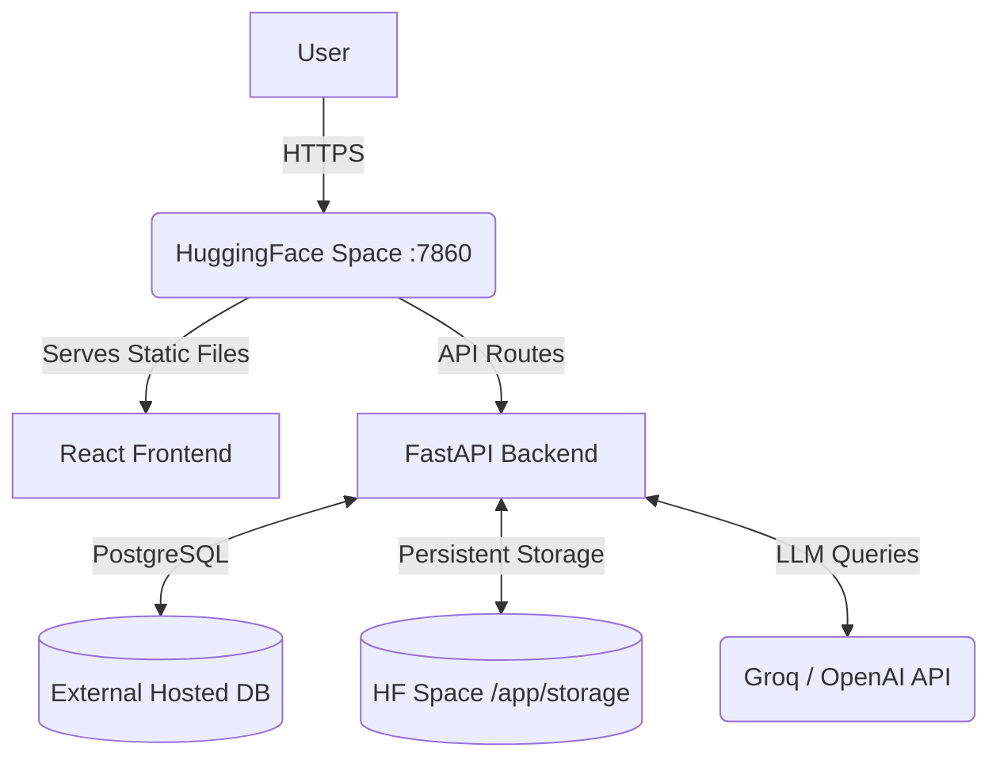

# DataVision AI - Complete MLOps Architecture & Lifecycle

This document describes the complete lifecycle of DataVision AI, from source code to model training, deployment, and monitoring on HuggingFace Spaces.

## 1. System Architecture

The application is deployed as a single monolithic Docker container on HuggingFace Spaces for simplicity and cost-effectiveness. 

## 2. CI/CD Pipeline

We utilize GitHub Actions to provide a zero-touch deployment experience.

1. **Local Development**: Developer works on code locally and tests using `docker-compose up`.
2. **Push to Main**: `git push origin main` triggers the GitHub Actions pipeline.
3. **CI Checks (`ci.yml`)**:
   - Runs `ruff` for Python linting and syntax checking.
   - Runs `npm run build` to ensure the React frontend compiles cleanly.
4. **Deployment (`deploy.yml`)**:
   - Pushes the source code (including the freshly built `frontend/dist`) to the HuggingFace remote using the `HF_TOKEN`.
5. **HuggingFace Build**:
   - HF detects the push, spins up a Build server, and executes the `Dockerfile`.
   - Python dependencies are installed.
6. **Container Startup (`start.sh`)**:
   - Space awakens.
   - `alembic upgrade head` executes to apply any new database schema migrations to the external PostgreSQL database.
   - `uvicorn` starts the FastAPI server on port 7860.

## 3. Storage & Persistence Strategy

Because Docker containers on HuggingFace are ephemeral (they sleep after inactivity and get completely rebuilt on new commits), persistence must be explicitly managed.

### Database (Structured Data)
- **What**: Users, channels, chat threads, report metadata, model metadata.
- **Where**: External PostgreSQL database (e.g., Neon).
- **Why**: Ephemeral SQLite would wipe user accounts every time the space sleeps.

### File Storage (Unstructured/Large Data)
- **What**: Uploaded CSV/Excel files, trained ML models (.pkl, .joblib), generated PDF/HTML reports, FAISS vector indexes.
- **Where**: `/app/storage` inside the container.
- **Why**: HuggingFace Spaces provides 50GB of persistent storage mounted at this directory. Our `Dockerfile` explicitly sets permissions on this folder to ensure the `appuser` can write to it.

## 4. Machine Learning Lifecycle

DataVision features an autonomous AutoML pipeline.

1. **Ingestion**: User uploads a CSV. It is parsed using pandas and saved to `/app/storage/uploads`.
2. **Preprocessing**: The Agentic system analyzes the data, imputes missing values, and encodes categoricals.
3. **Training**: LightGBM/CatBoost/XGBoost models are trained in memory. 
4. **Persistence**: The best performing model pipeline is serialized using `joblib` and saved to `/app/storage/models/{model_id}.pkl`. Model metadata is saved to PostgreSQL.
5. **Deployment**: When a user queries the model, the backend uses `model_deployer.py` to deserialize the model into memory. 
6. **Inference**: User provides new data; the in-memory engine predicts the outcome.
7. **Retirement**: The user can delete the model via the UI, which soft-deletes it in Postgres and removes the `.pkl` file from persistent storage.

## 5. Security Practices

- **Non-root Execution**: The `Dockerfile` creates a dedicated `appuser`. The application does not run as root.
- **Secrets Management**: No API keys are in the codebase. All keys (`GROQ_API_KEY`, `DATABASE_URL`, `JWT_SECRET`) are securely injected via HuggingFace Space Secrets at runtime.
- **Rate Limiting**: The `core/rate_limiter.py` module protects expensive endpoints (like LLM generation and model training) from abuse.
- **Data Isolation**: Files are stored in user-specific directories (`/app/storage/users/{user_id}/`).

## 6. Rollback Procedure

If a deployment fails or introduces a critical bug:
1. Revert the commit locally: `git revert HEAD`
2. Push to main: `git push origin main`
3. The CI/CD pipeline will automatically build and deploy the reverted, stable code.

If database migrations caused the issue, you may need to manually downgrade the database using Alembic before reverting the code, or restore the database from a backup via your Postgres provider (e.g. Neon's point-in-time recovery).
